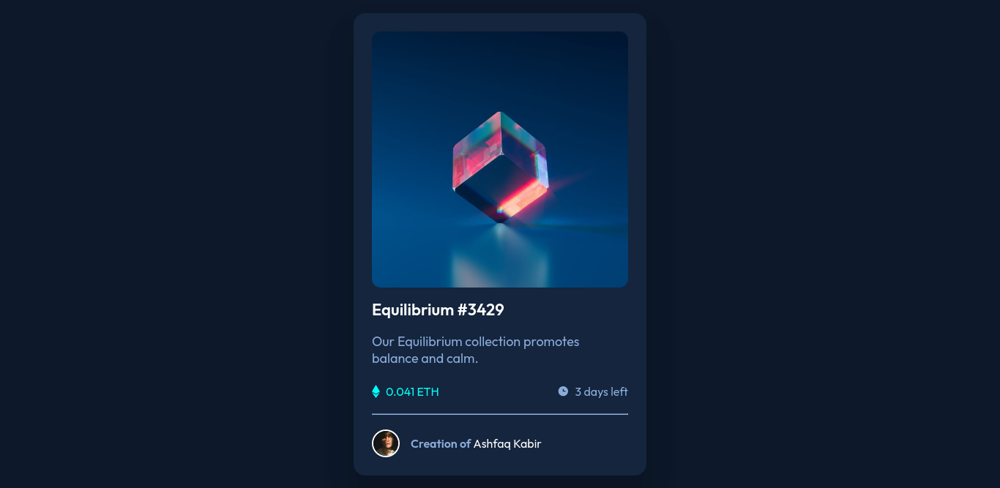

# Frontend Mentor - NFT preview card component

## Table of contents

- [Overview](#overview)
  - [The challenge](#the-challenge)
  - [Links](#links)
- [My process](#my-process)
  - [Built with](#built-with)
- [Author](#author)

## Overview

### The challenge

Users should be able to:

- View the optimal layout depending on their device's screen size
- See hover states for interactive elements

### Links

- Solution URL: [Git Repo](https://github.com/AshfaqKabir/Frontend-Mentor/tree/main/nft-preview-card-component)
- Live Site URL: [https://nft-card-components.netlify.app/](https://nft-card-components.netlify.app/)

## My process

### Built with

- Semantic HTML5 markup
- CSS custom properties
- Flexbox
- Mobile-first workflow

## Author

- Website - [Ashfaq Kabir](https://ashfaqkabir.com/)
- Frontend Mentor - [@AshfaqKabir](https://www.frontendmentor.io/profile/AshfaqKabir)
- Twitter - [@ashfaqkabir2115](https://twitter.com/ashfaqkabir2115)
